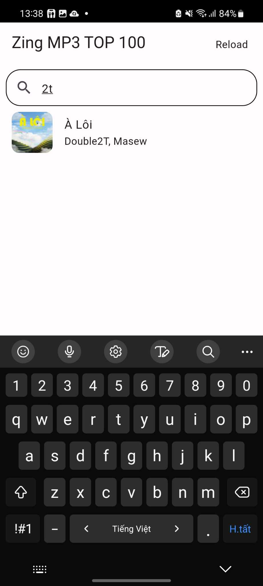
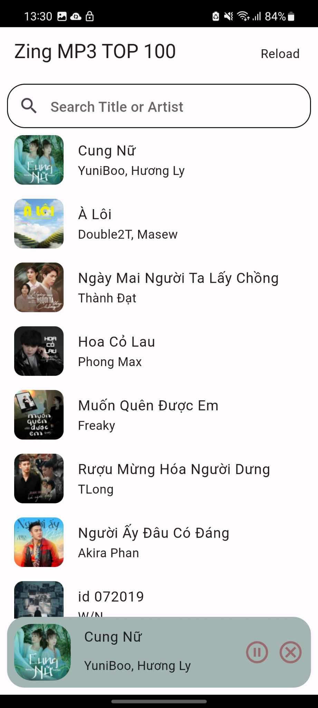
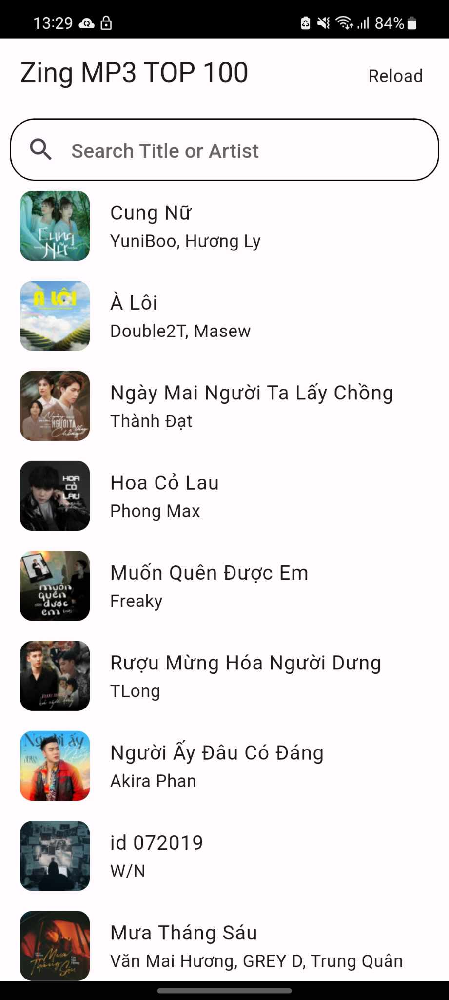

## MusicPlayer ⌒
install app-release.apk
 
 

## Previews ⛶

 

 

 

## Feature roadmap ⌲
- [x]  Allows users to view the list of songs on zingchart https://m.zingmp3.vn/zing-chart.
- [x]  Each song in the list will show: song title, artist name and album cover.
- [x]  When a song is selected, it will start playing.
- [x]  There is a progress bar that shows the currently playing song, along with the song title, artist name, and album art.
- [x]  There are play, pause and stop buttons to control.
- [x]  There is a search bar to filter songs by title or artist name.
- [x]  Play music in the background so that it continues to play even when the screen is off or another application is open.
- [x]  Get music from the website automatically (not manually).
- [x]  Simple code, not applying clean code (Robert C. Martin style).
